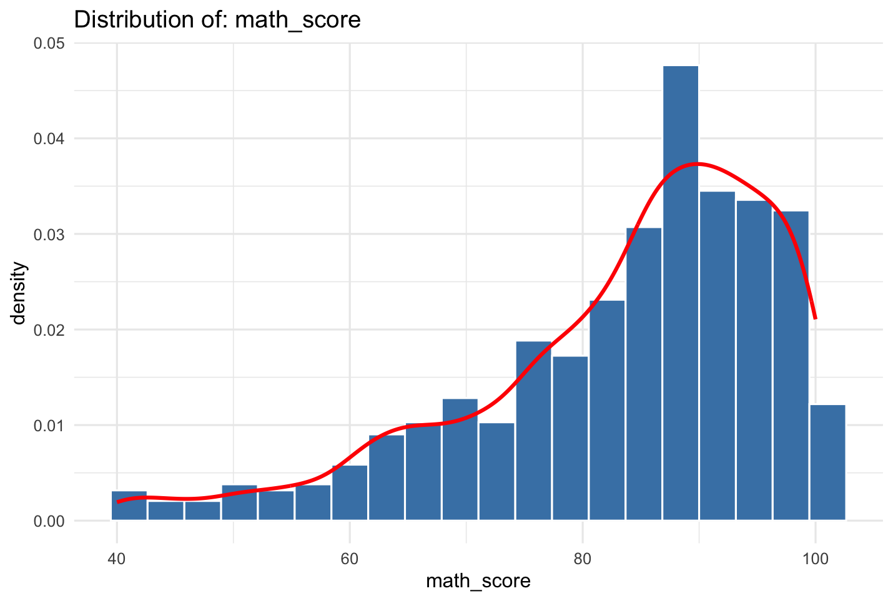
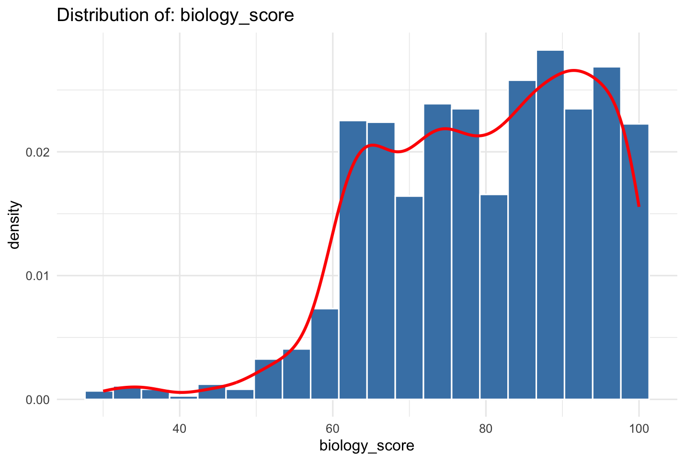
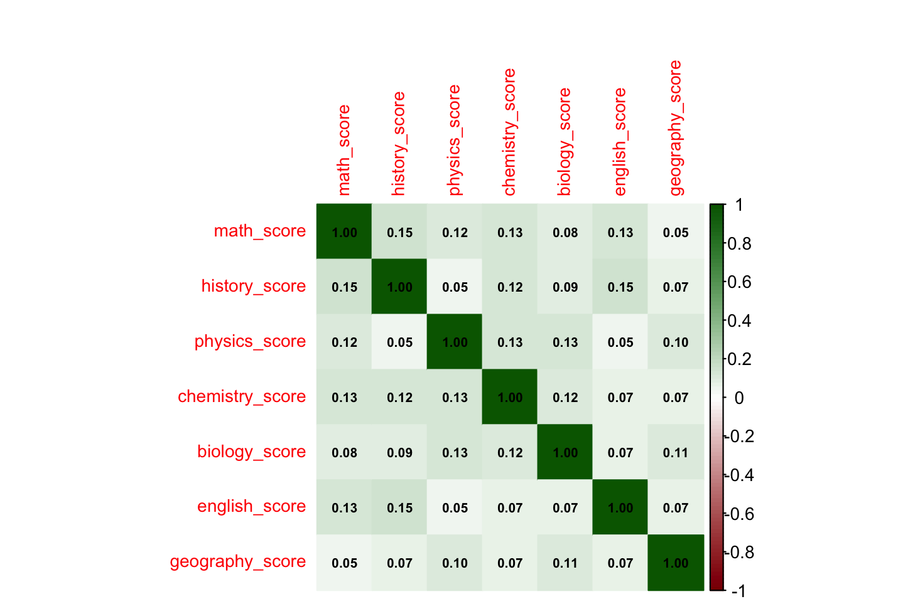
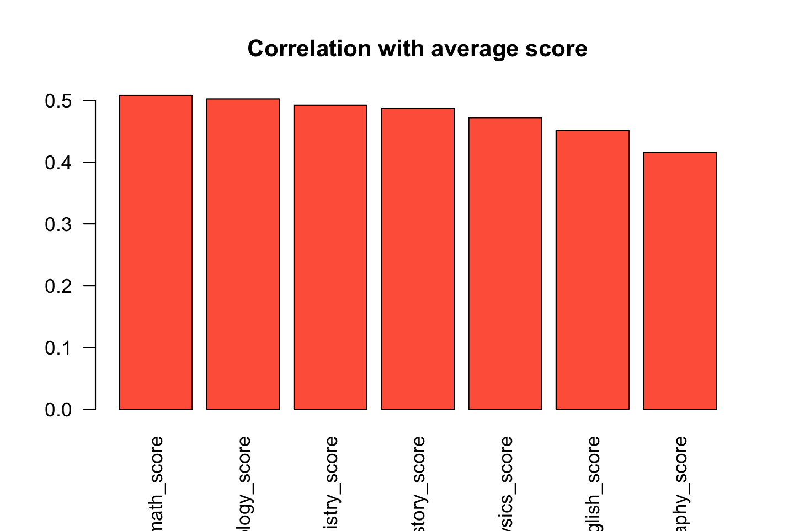
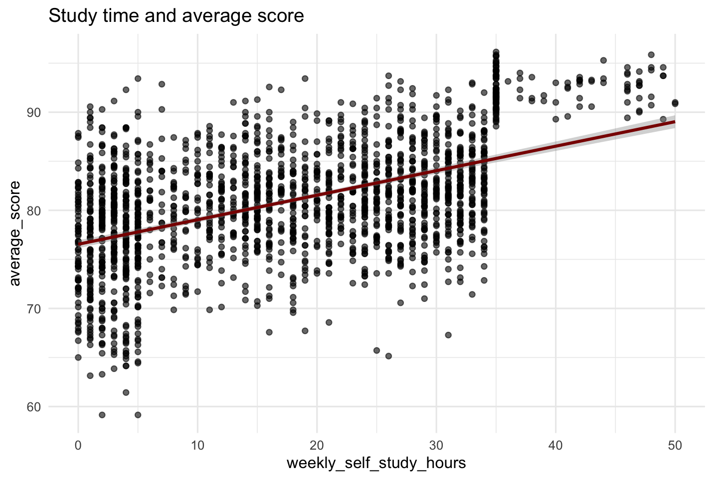
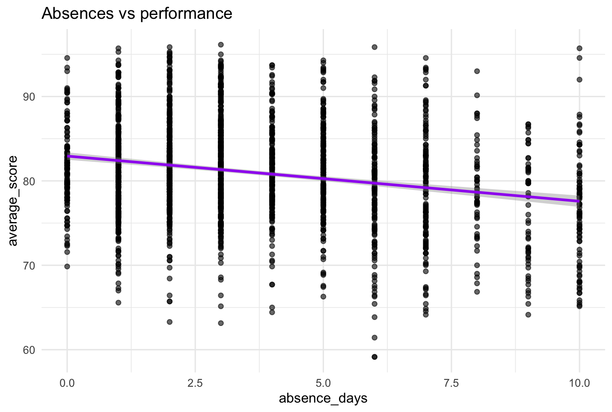
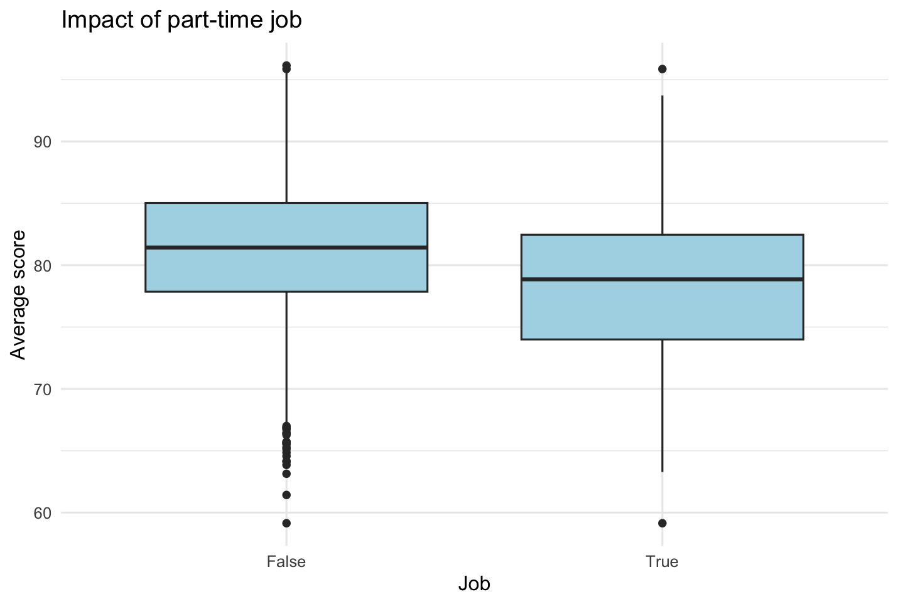
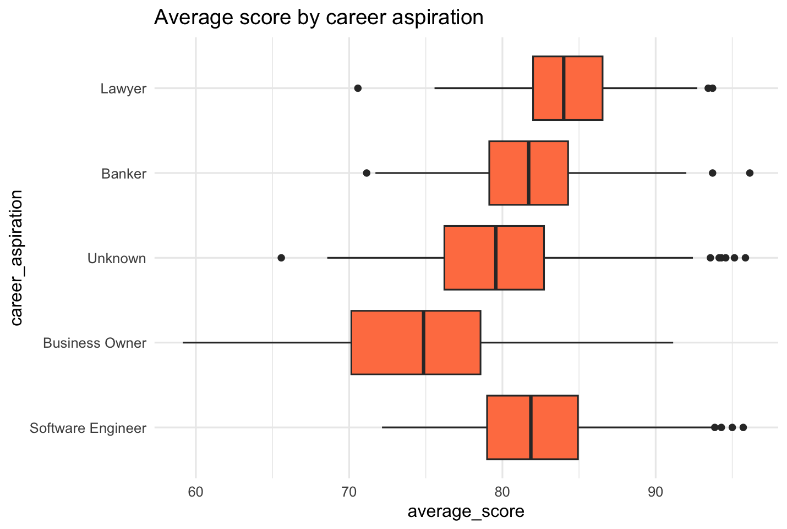
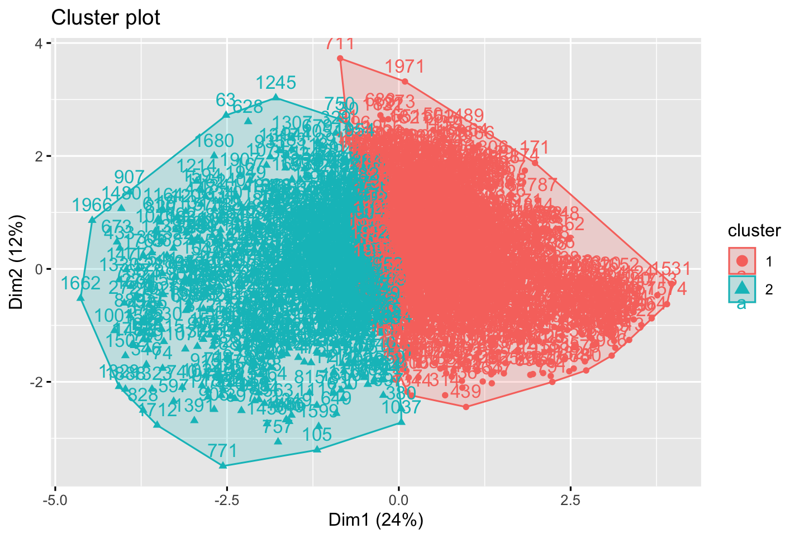

## Project Overview

This project analyzes student performance data to identify key factors influencing academic success. Using machine learning and statistical techniques, we explore relationships between student characteristics (study habits, extracurricular activities, etc.) and academic outcomes.

**Goal**: Understand what factors impact student academic performance and build predictive models for student success.

**Target Variables**:

- `math_score`, `physics_score`, `biology_score`, `geography_score`
- `average_score` (engineered feature)
- `high_achiever` (binary classification target)

## Key Insights from EDA

### Distribution of Scores

All subject scores show approximately normal distributions with varying means and spreads. Mathematics and biology scores show the strongest correlation with overall average performance. Positive correlation is observed between weekly self-study hours and average score. Students without part-time jobs perform better (average score 82 vs 77), and absences negatively correlate with performance. Extracurricular activities have a moderate positive impact. Mathematics and biology scores are most strongly correlated with average performance (r > 0.85).

### Scores Overview

|  |  |  |
|:---:|:---:|:---:|
| Math | Biology | English |

### Correlation Plots

|  |  |
|:---:|:---:|
| Correlation Heatmap | Correlation with Average Score |

## Bivariate Analysis

### Quantitative Variables vs Average Score

|  |  |
|:---:|:---:|
| Study Time | Absence Days |

### Categorical Variables vs Average Score

|  |  |  |
|:---:|:---:|:---:|
| Part-time Job | Extracurricular Activities | Career aspiration |

## Clustering Analysis

|  |  |
|:---:|:---:|
| Optimal number of clusters | Cluster plot |

K-means clustering identified 2 student profiles:  

- High Achievers (high scores, moderate study hours, low absences)  
- At-Risk Students (low scores, high absences, variable study patterns)  

## Machine Learning Models

### Regression Models (Predicting Average Score)

|  |
|:---:|
| Regression Models Comparison |

**Interpretation**:

- Random Forest and XGBoost outperform linear regression  
- XGBoost achieves the best performance (RMSE = 1.28)  
- High R² values (0.94+) indicate models explain nearly all variability in data  

### Classification Models (Predicting High Achievers)

|  |
|:---:|
| Classification Models Comparison |

**Interpretation**:

- Tree-based models significantly outperform logistic regression for classification  
- XGBoost achieves the best overall performance with 96.8% accuracy  
- High AUC scores (0.99+) indicate excellent class separation capability  

## Results Interpretation

### Academic Implications

- Self-study hours show positive correlation with performance  
- Part-time employment negatively impacts performance (~5 point difference)  
- Absences have a negative relationship with performance  
- Mathematics proficiency is the strongest predictor of overall academic success  

### Model Selection Guidance

- For precise score prediction: Use XGBoost (RMSE = 1.28)  
- For identifying high achievers: Use XGBoost (Accuracy = 96.8%)  
- For interpretability: Use Random Forest (good performance with feature importance)  

### Dat scources
[Kaggle - Student Score](https://www.kaggle.com/code/mostafafathy33/student-score)
